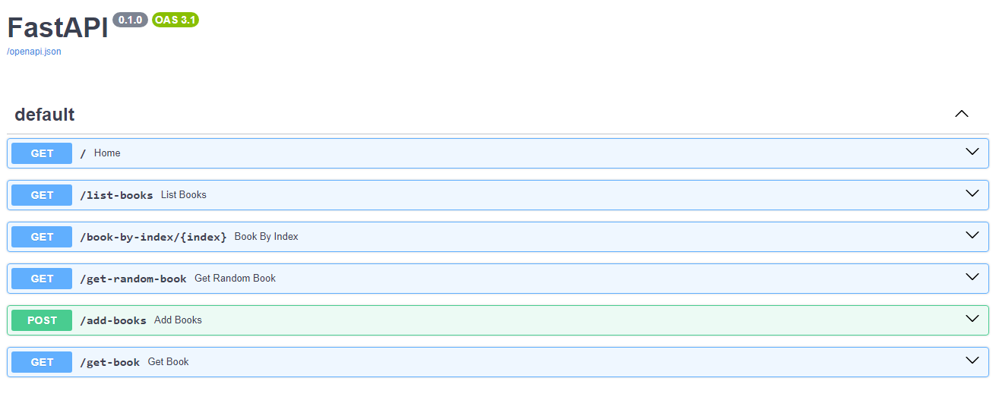

# FastAPI

- a deep dive into FastAPI for beginners
  

## Table of Contents

- [Technologies Used](#technologies-used)
- [Installation](#Installation)
- [API Endpoints](#api-endpoints)
- [Deploying to AWS EC2](#Deploying-to-AWS-EC2)
- [Notes](#notes)
- [Contributing](#contributing)
- [License](#license)
- [Contact](#contact)

## Technologies Used

- fastapi
- uvicorn
- mangum

## installation

- `pip install fastapi uvicorn`

## API Endpoints

- GET [api/](http://127.0.0.1:8000) - welcome
- GET [api/list-books](http://127.0.0.1:8000/list-books)- list books
- GET [api/book-by-index/{index}](http://127.0.0.1:8000/book-by-index/{index}) - get book using index
- GET [api/get-random-book](http://127.0.0.1:8000/get-random-book)- get a random book
- POST [api/add-books](http://127.0.0.1:8000/add-books) - add books using base model
- GET [api/get-book](http://127.0.0.1:8000/get-book)- get book using book_id

## Deploying to AWS EC2

- Deploying a FastAPI application on AWS EC2 involves several steps, including setting up the EC2 instance, configuring the environment, and deploying your FastAPI app.

### Step 1: Set Up an AWS EC2 Instance

1. Launch an EC2 Instance:

   - Log in to your AWS Management Console.
   - Navigate to the EC2 Dashboard and click on “Launch Instance”.
   - Choose an Amazon Machine Image (AMI). The most commonly used one is the Amazon Linux 2 AMI.
   - Select an instance type (e.g., t2.micro for free tier).
   - Configure instance details, storage, and tags as needed.
   - Configure security groups to allow traffic on ports 22 (SSH), 80 (HTTP), and 443 (HTTPS) if you plan to use SSL.
   - Review and launch the instance, and download the key pair (.pem file) for SSH access.

2. Connect to Your EC2 Instance:
   - SSH into the instance and run these commands to update the software repository and install our dependencies.

```
ssh -i /path/to/your-key.pem ec2-user@your-ec2-instance-public-ip
```

### Step 2: Install Dependencies

1. Update Packages:

```
sudo apt-get update
sudo apt install -y python3-pip nginx
```

### Step 3: Set Up Your FastAPI Application

1. Create a FastAPI App:

```
mkdir fastapi-app
cd fastapi-app
```

2. Clone the FastAPI server app (or create your main.py in Python).

```
git clone https://github.com/MwangiSara/FastAPI-To-AWS.git
```

3. Test Your App Locally:

```
uvicorn main:app --reload --host 0.0.0.0 --port 8000
```

### Step 4: Configure Nginx

1. Configure Nginx:

- Create an Nginx configuration file for your FastAPI app.

```
sudo nano /etc/nginx/conf.d/fastapi.conf
```

- Add the FastAPI configuration to NGINX's folder. Create a file called fastapi_nginx (like the one in this repository).

```
sudo vim /etc/nginx/sites-enabled/fastapi_nginx
```

- And put this config into the file (replace the IP address with your EC2 instance's public IP):

```
server {
    listen 80;
    server_name <YOUR_EC2_IP>;
    location / {
        proxy_pass http://127.0.0.1:8000;
    }
}
```

- Start NGINX.

```
sudo service nginx restart
```

- Start FastAPI.

```
cd fastapi-tutorial
python3 -m uvicorn main:app
```

## Notes

- FastAPI is a modern, fast (high-performance), web framework for building APIs with Python 3.7+ based on standard Python type hints.
- Uvicorn is a lightning-fast ASGI server implementation, using uvloop and httptools. It is designed to be an asynchronous server that can handle a high number of concurrent connections, making it an excellent choice for running FastAPI applications.
- FastAPI handles the request routing, validation, and response serialization. It uses Python type hints to automatically generate documentation and ensure data correctness. Uvicorn runs the FastAPI application. It listens for incoming HTTP requests, passes them to the FastAPI application, and returns the responses to the client. Uvicorn's asynchronous capabilities ensure that the application can handle many simultaneous connections efficiently.
- HttpException(String, Exception) Initializes a new instance of the HttpException class using an error message and the InnerException property. HttpException(String, Int32) Initializes a new instance of the HttpException class using an error message and an exception code.
- Query parameters can be used to control the number of results returned by the API and to control the starting point for the results. For example, a query parameter might be used to specify that the API should return the first 10 results or that it should start returning results from the 20th item.
- Pydantic is a Python library for data validation and settings management using Python-type annotations. It ensures that the data you work with matches your specified data types, simplifying error handling and data parsing in Python applications.

### Asynchronous and Synchronous Execution

- Synchronous Execution: The function executes synchronously, meaning it will block the execution of other tasks until it completes. This is generally fine for CPU-bound operations or simple logic that does not involve I/O.
- Blocking I/O Operations: If this function performs any I/O operations (e.g., database queries, HTTP requests, file I/O), it will block the event loop until the I/O operation is complete, potentially reducing the efficiency and performance of your application. example of synchronous:

```

@app.get("/")
def home():
return {"message": "Hello, World"}

```

- Asynchronous Execution: The function executes asynchronously, meaning it can pause its execution to let other tasks run while waiting for I/O operations to complete. This can lead to more efficient use of resources and better performance, especially for I/O-bound operations.
- Non-blocking I/O Operations: Asynchronous functions can perform non-blocking I/O operations using await. This allows the event loop to handle other tasks while waiting for the I/O operation to complete, improving the scalability and responsiveness of your application.

```

@app.get("/")
async def home():
return {"message": "Hello, World"}

```

#### When to Use Each

1. Use def (Synchronous) When:
   - Your function performs CPU-bound tasks that do not involve waiting for external resources. Your function is simple and does not involve any I/O operations. Your application does not need to handle a large number of concurrent requests.

```

@app.get("/sync")
def read_sync(): # Simulate a blocking I/O operation
import time
time.sleep(5)
return {"message": "This is a synchronous endpoint"}

```

2. Use async def (Asynchronous) When:

- Your function performs I/O-bound tasks, such as database queries, HTTP requests, or file operations. You want to improve the performance and scalability of your application by allowing it to handle many concurrent requests efficiently. You need to integrate with other asynchronous libraries or functions.

```

@app.get("/async")
async def read_async(): # Simulate a non-blocking I/O operation
await asyncio.sleep(5)
return {"message": "This is an asynchronous endpoint"}

```

### `typing` Module

- The typing module in Python is used to provide type hints, which help specify the expected data types of variables, function arguments, and return values. This can improve code readability, enable better tooling support, and help catch bugs earlier in the development process.

#### Key Features of the typing Module

1. Type Annotations for Variables:

```

        from typing import List, Dict

        my_list: List[int] = [1, 2, 3]
        my_dict: Dict[str, int] = {"one": 1, "two": 2}

```

2. Type Annotations for Function Arguments and Return Values:

```

from typing import Tuple

def add(x: int, y: int) -> int:
return x + y

def get_user() -> Tuple[int, str]:
return 1, "John Doe"

```

3. Generic Types: Used to specify that a type can be any of a specified list of types.

```

from typing import Union

def process_data(data: Union[int, str]) -> str:
return str(data)

```

4. Optional Types: Used to specify that a value could be of a given type or None.

```

from typing import Optional

def greet(name: Optional[str] = None) -> str:
if name:
return f"Hello, {name}"
return "Hello, World"

```

5. Callable Types: Used to specify a function signature.

```

from typing import Callable

def apply_function(func: Callable[[int, int], int], x: int, y: int) -> int:
return func(x, y)

```

6. Type Variables: Used for generic programming.

```

from typing import TypeVar, List

T = TypeVar('T')

def get_first_element(lst: List[T]) -> T:
return lst[0]

```

6. NewType: Used to create distinct types.

```

from typing import NewType

UserId = NewType('UserId', int)

def get_user_name(user_id: UserId) -> str: # Assume some implementation here
return "John Doe"

```

### `uuid` Module

- The uuid module in Python is used for generating universally unique identifiers (UUIDs). UUIDs are 128-bit numbers used to uniquely identify information in computer systems. They are widely used in software development for various purposes, such as identifying database records, sessions, or any unique entity.

#### Types of UUIDs

- The uuid module supports the following types of UUIDs:

1. UUID1: Based on the host's MAC address and the current time. Generates a UUID based on the host's MAC address and the current time.

```

import uuid

uuid1 = uuid.uuid1()
print(f"UUID1: {uuid1}")

```

2. UUID3: Based on an MD5 hash of a namespace identifier and a name. Generates a UUID based on an MD5 hash of a namespace identifier and a name.

```

namespace = uuid.NAMESPACE_DNS
name = 'example.com'
uuid3 = uuid.uuid3(namespace, name)
print(f"UUID3: {uuid3}")

```

3. UUID4: Randomly generated UUID.

```

uuid4 = uuid.uuid4()
print(f"UUID4: {uuid4}")

```

4. UUID5: Based on a SHA-1 hash of a namespace identifier and a name. Generates a UUID based on a SHA-1 hash of a namespace identifier and a name.

```

namespace = uuid.NAMESPACE_DNS
name = 'example.com'
uuid5 = uuid.uuid5(namespace, name)
print(f"UUID5: {uuid5}")

```

5. UUID(hex): Create a UUID from a string of 32 hexadecimal digits.

```

hex_uuid = uuid.UUID('12345678123456781234567812345678')
print(f"UUID from hex: {hex_uuid}")

```

### fastapi.encoders

- The fastapi.encoders module in FastAPI provides utility functions for encoding data types that are not directly serializable by the standard JSON encoder. This module is particularly useful for preparing data to be returned in API responses or to be stored in JSON-compatible formats.

#### Key Functions in fastapi.encoders

1. jsonable_encoder: The primary function in the fastapi.encoders module. Converts data types that are not natively serializable by the default Python JSON encoder into JSON-compatible data types.

```

def jsonable_encoder(
obj: Any,
include: Optional[Union[Set[str], Dict[str, Any]]] = None,
exclude: Optional[Union[Set[str], Dict[str, Any]]] = None,
by_alias: bool = False,
skip_defaults: bool = False,
exclude_unset: bool = False,
exclude_defaults: bool = False,
exclude_none: bool = False,
) -> Any:

```

Parameters

- obj: The object to encode.
- include: A set or dictionary of fields to include in the output.
- exclude: A set or dictionary of fields to exclude from the output.
- by_alias: Use the field's alias in the output if it has one.
- skip_defaults: Skip fields with default values in the output.
- exclude_unset: Exclude fields that were not set in the model.
- exclude_defaults: Exclude fields that are set to their default values.
- exclude_none: Exclude fields that are set to None.

```

from fastapi.encoders import jsonable_encoder
from datetime import datetime
from pydantic import BaseModel

class Item(BaseModel):
name: str
description: str
price: float
created_at: datetime

item = Item(
name="FastAPI",
description="A modern web framework for Python",
price=0.0,
created_at=datetime.now()
)

json_compatible_item_data = jsonable_encoder(item)
print(json_compatible_item_data)

```

- In this example, jsonable_encoder converts the Item Pydantic model instance into a dictionary with JSON-compatible data types.
- you can exclude some variables. This example excludes the price field from the encoded data.

```

json_compatible_item_data = jsonable_encoder(item, exclude={"price"})
print(json_compatible_item_data)

```

- you can use aliases. This example uses field aliases when encoding the model.

```

class Item(BaseModel):
name: str
description: str
price: float
created_at: datetime

    class Config:
        fields = {
            "created_at": "createdAt"
        }

item = Item(
name="FastAPI",
description="A modern web framework for Python",
price=0.0,
created_at=datetime.now()
)

json_compatible_item_data = jsonable_encoder(item, by_alias=True)
print(json_compatible_item_data)

```

## Contributing

Contributions are welcome! Please open an issue or submit a pull request with any improvements or new features. Here are the Steps

1. Fork the repository
2. Create a new branch (git checkout -b feature-name)
3. Make your changes
4. Commit your changes (git commit -m 'Add new feature')
5. Push to the branch (git push origin feature-name)
6. Open a pull request

## License

This project is licensed under the MIT License.

## Contact

If you have any questions, feel free to reach out:

- Name: Sarah Mwangi
- Email: mwangisarah113@gmail.com
- GitHub: Mwangisara

```

```
